# About

This document describes an unsuccessful repair attempt of a Loewe Soundvision from about 2011. It provides information about the embedded linux system, a serial port and the eMMC flash. It was written postmortem, so most pictures show the parts after I had already tinkered with them. 

Failure description:

Only "Loewe" logo on the display, nothing else happens.


# Summary

* The device has a serial linux console
* eMMC is corrupted / defective
* Relevant files can be extracted from firmware update package
* eMMC can be accessed on board by attaching an SD card reader
* I failed to solder a replacement eMMC chip back on the board


# Disassembly
I found the service manual on the site manualslib.de. It provides a detailed disassembly procedure with pictures. Torx tools of various sizes are needed.

In my device the ribbon cable between the amplifier and the interface board could not be unplugged as shown in the manual (non-removable connection).

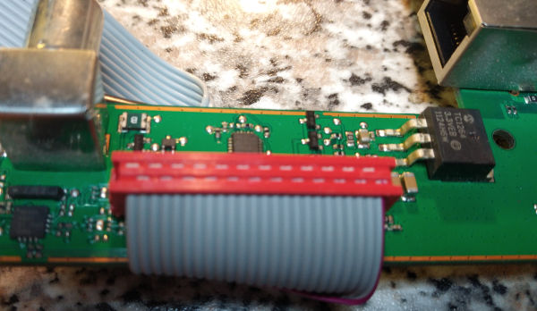

The manual shows how to remove the display unit from the chassis but does not show how to disassemble the display unit itself. The display unit contains the embedded linux system. You need to remove the screws at the bottom of the display unit and then use a suction cup to pull the display out. Some more screws need to be removed to separate the display from the remaining boards. The display backlight wires need to be desoldered (no connector). Additional conections are a flat-flex cable and a small connector for the touchpad.

The remaining boards are a board labeled "Peripheral", which has a daughter board in a laptop RAM socket. This daughter board (I'll call it "CPU board") contains the linux system.

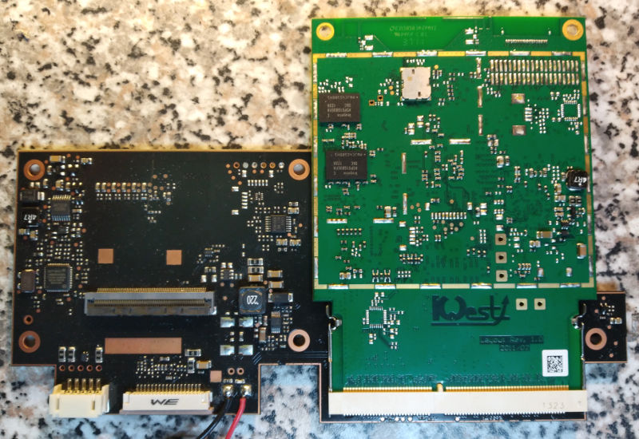

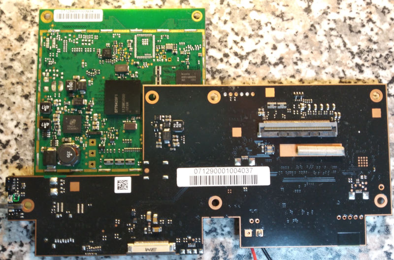

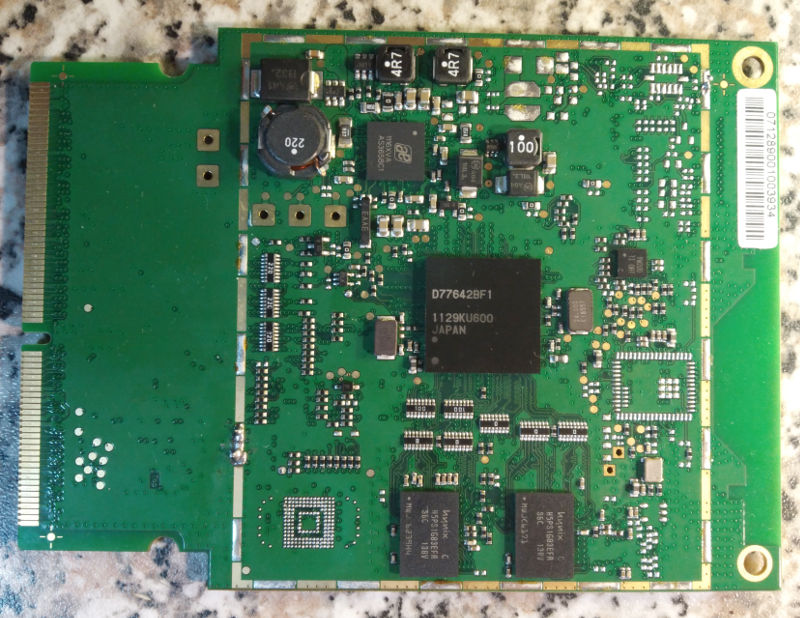

For the following experiments most of the boards were on the workbench electrically connected together again. I excluded the iPhone dock board, the CD drive, the keyboard and in most cases also the display.

# Serial port

## Where to connect
The serial port is on the "Peripheral" board. 3.3V digital level, 115200 baud, 8-n-1

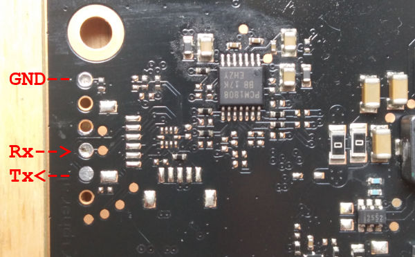

## Boot messages
At startup it shows u-boot messages followed by the linux system starting up and then a login prompt. Login is possible with username "root" and no password. U-boot is locked, I could not interrupt the boot process to get to the u-boot prompt.

First part of startup messages:

```
Start eMMC mini-boot 	 V.13	Oct 21 2011 21:34:21
load u-boot

Current sys = 2
load kernel_info 0x4200
load kernel with size 0x354760
jump to u-boot


U-Boot 2009.03-rc1 (Okt 21 2011 - 21:34:03)

Booted Device: eMMC
Board: EM/EV ES3 (Rev.00000430)
U-Boot for: Soundvision 2
System voltage: 8536000 uV -> OK
DRAM:  512 MB
## Unknown FLASH on Bank 1 - Size = 0x00000000 = 0 MB
Flash:  0 kB
In:    serial
Out:   serial
Err:   serial
Hit any key to stop autoboot:  0 
reconfigure rootfs env to boot system 2
run_command (s, 0); == "run ext3cmd"
## Booting kernel from Legacy Image at 40007fc0 ...
   Image Name:   Linux-2.6.29
   Image Type:   ARM Linux Kernel Image (uncompressed)
   Data Size:    3491616 Bytes =  3.3 MB
   Load Address: 40008000
   Entry Point:  40008000
   Verifying Checksum ... OK
   Loading Kernel Image ... OK
OK

Starting kernel ...

Linux version 2.6.29 (jbivens@jbivens-desktop) (gcc version 4.3.3 (GCC) ) #1 SMP PREEMPT Mon Dec 19 12:35:47 CET 2011
CPU: ARMv7 Processor [411fc093] revision 3 (ARMv7), cr=10c57c7f
CPU: VIPT nonaliasing data cache, VIPT nonaliasing instruction cache
Machine: EMXX
[...]
```

The distribution used is Angstrom for beagleboard. Even the host name is not changed and says "beagleboard".

```
.-------.                                           
|       |                  .-.                      
|   |   |-----.-----.-----.| |   .----..-----.-----.
|       |     | __  |  ---'| '--.|  .-'|     |     |
|   |   |  |  |     |---  ||  --'|  |  |  '  | | | |
'---'---'--'--'--.  |-----''----''--'  '-----'-'-'-'
                -'  |
                '---'

The Angstrom Distribution beagleboard ttyS0

Angstrom 2010.7-test-20110220 beagleboard ttyS0

beagleboard login:
```


My system was showing an error during boot, complaining about file system errors.

```
EXT3-fs error (device mmcblk0p4): ext3_check_descriptors: Inode table for group 0 not in group (block 1328195245)!
EXT3-fs: group descriptors corrupted!
logger: mount: wrong fs type, bad option, bad superblock on /dev/mmcblk0p4,
logger:        missing codepage or helper program, or other error
logger:        In some cases useful info is found in syslog - try
logger:        dmesg | tail  or so
logger: 
```

## Repeated error messages after boot

Even after boot, some processes seemed to fail and got repeatedly restarted. 

```
ls: /home/root/system-connections/: No such file or directory
Restarting desktopaudio.
/opt/loewe/bin/desktopaudio: error while loading shared libraries: l)bglib-2.0.so.0: cannot open shared object file: No such file or directory
```

I needed to kill two startup scripts to get rid of these error messages. Relevant part of `ps ax` output:
```
  570 ?        S      0:00 /bin/sh /etc/rc5.d/S90Loewe.sh
  572 ?        S      0:00 /bin/sh /etc/rc5.d/S98wlanupdate.sh
```

The `S98wlanupdate.sh` script cannot find the `/home/root/system-connections/` folder because partition mmcblk0p4 should be mounted on `/home/root` but isn't because the file system is broken.

The `S90Loewe.sh` script tries to launch the main application of the device, which fails with an interesting error message. Note the ')' character in `l)bglib-2.0.so.0`. This indicates further file system errors on the mounted root partition. Restarting the device several times results in the same error message each time, so this is not some intermittent electrical issue.

## Poking around

Plugging in an ethernet cable didn't connect automatically. `ifconfig eth0 [ip address]` was needed to set a static IP address. I couldn't start Wifi, but didn't try a lot. Files could be transferred to the PC by USB drive or netcat.

Using the `dd` command I tried to salvage the flash partitions in their current state for later repair attempts at the PC.

`dd if=/dev/mmcblk0p3 | nc -l -p 1234` etc.

It did not work out, I only got small files, error messages and the board seemed to crash and did not respond anymore due to flash read errors.


<details><summary>`ps ax` output</summary>
<p>

```
  PID TTY      STAT   TIME COMMAND
    1 ?        Ss     0:00 init [5]           
    2 ?        S<     0:00 [kthreadd]
    3 ?        S<     0:00 [migration/0]
    4 ?        S<     0:00 [ksoftirqd/0]
    5 ?        S<     0:00 [migration/1]
    6 ?        S<     0:00 [ksoftirqd/1]
    7 ?        S<     0:00 [events/0]
    8 ?        S<     0:00 [events/1]
    9 ?        S<     0:00 [work_on_cpu/0]
   10 ?        S<     0:00 [work_on_cpu/1]
   11 ?        S<     0:00 [khelper]
   12 ?        S<     0:00 [kblockd/0]
   13 ?        S<     0:00 [kblockd/1]
   14 ?        S<     0:00 [ksuspend_usbd]
   15 ?        S<     0:00 [khubd]
   16 ?        S<     0:00 [kmmcd]
   17 ?        S<     0:00 [bluetooth]
   18 ?        S<     0:00 [msp430/0]
   19 ?        S<     0:00 [msp430/1]
   20 ?        S      0:00 [pdflush]
   21 ?        S      0:00 [pdflush]
   22 ?        S<     0:00 [kswapd0]
   23 ?        S<     0:00 [aio/0]
   24 ?        S<     0:00 [aio/1]
   25 ?        S<     0:00 [emxx_fb]
   26 ?        S<     0:00 [emxx_lcd]
   27 ?        D<     0:00 [si4705_wq/0]
   28 ?        S<     0:00 [si4705_wq/1]
   29 ?        S<     0:00 [cdmm10_fsm/0]
   30 ?        S<     0:00 [cdmm10_fsm/1]
   31 ?        S<     0:00 [cdmm10_irq/0]
   32 ?        S<     0:00 [cdmm10_irq/1]
   33 ?        S<     0:00 [ehci-wq]
   34 ?        S<     0:00 [tas5716_psm]
   35 ?        S<     0:00 [mmcqd]
   36 ?        S<     0:00 [krfcommd]
   37 ?        S<     0:00 [kjournald]
   65 ?        S<s    0:00 /sbin/udevd -d
  430 ?        Ss     0:00 /sbin/portmap
  459 ?        Ss     0:00 /usr/bin/dbus-daemon --system
  463 ?        Ssl    0:00 /usr/sbin/hald
  464 ?        S      0:00 hald-runner
  480 ?        S      0:00 hald-addon-input: Listening on /dev/input/event0
  501 ?        S<     0:00 /sbin/udevd -d
  508 ?        S<     0:00 [intr_work]
  511 ?        S<     0:00 /sbin/udevd -d
  532 ?        Ss     0:00 /usr/sbin/NetworkManager
  536 ?        S      0:00 /bin/sh /etc/rc5.d/S89timeset.sh
  564 ?        S      0:00 /usr/sbin/wpa_supplicant -u
  568 ?        Ss     0:00 /usr/sbin/lircd -d /dev/lirc0 -o /dev/lircd -r /etc/l
  570 ?        S      0:00 /bin/sh /etc/rc5.d/S90Loewe.sh
  572 ?        S      0:00 /bin/sh /etc/rc5.d/S98wlanupdate.sh
  579 ?        Ss     0:00 login -- root     
  581 ?        S      0:00 sleep 20
  582 tty1     Ss+    0:00 /sbin/getty 38400 tty1
  598 ?        Ss     0:00 /usr/bin/dbus-daemon --fork --print-pid 4 --print-add
  622 ttyS0    Ss     0:00 -sh
  625 ?        S      0:00 sleep 2
  642 ?        S      0:00 sleep 2
  643 ttyS0    R+     0:00 ps ax
```

</p>
</details>


<details><summary>`mount` output</summary>
<p>

```
rootfs on / type rootfs (rw)
/dev/root on / type ext3 (rw,errors=continue,data=ordered)
proc on /proc type proc (rw)
sysfs on /sys type sysfs (rw)
none on /dev type tmpfs (rw,mode=755)
devpts on /dev/pts type devpts (rw,gid=5,mode=620)
usbfs on /proc/bus/usb type usbfs (rw)
tmpfs on /var/volatile type tmpfs (rw)
tmpfs on /dev/shm type tmpfs (rw,mode=777)
tmpfs on /media/ram type tmpfs (rw)
```

</p>
</details>

<details><summary>`fdisk -l /dev/mmcblk0` output</summary>
<p>

```
Disk /dev/mmcblk0: 1807 MB, 1807745024 bytes
4 heads, 16 sectors/track, 55168 cylinders, total 3530752 sectors
Units = sectors of 1 * 512 = 512 bytes
Sector size (logical/physical): 512 bytes / 512 bytes
I/O size (minimum/optimal): 512 bytes / 512 bytes
Disk identifier: 0x00000000

        Device Boot      Start         End      Blocks   Id  System
/dev/mmcblk0p1            2048       32767       15360   83  Linux
/dev/mmcblk0p2           32768     1081343      524288   83  Linux
/dev/mmcblk0p3         1081344     2129919      524288   83  Linux
/dev/mmcblk0p4         2129920     3530751      700416   83  Linux
```

</p>
</details>

<details><summary>`/etc/fstab` contents</summary>
<p>

```
# stock fstab - you probably want to override this with a machine specific one

rootfs               /                    auto       defaults              1  1
proc                 /proc                proc       defaults              0  0
devpts               /dev/pts             devpts     mode=0620,gid=5       0  0
usbfs                /proc/bus/usb        usbfs      defaults              0  0
tmpfs                /var/volatile        tmpfs      defaults              0  0
tmpfs                /dev/shm             tmpfs      mode=0777             0  0
tmpfs                /media/ram           tmpfs      defaults              0  0

# uncomment this if your device has a SD/MMC/Transflash slot
#/dev/mmcblk0p1       /media/card          auto       defaults,sync,noauto  0  0

/dev/mmcblk0p4 /home/root auto defaults 1 1
```

</p>
</details>


<details><summary>`lsusb` output</summary>
<p>

```
Bus 001 Device 001: ID 1d6b:0002 Linux Foundation 2.0 root hub
Bus 001 Device 002: ID 0424:2514 Standard Microsystems Corp. 
Bus 001 Device 003: ID 0424:9512 Standard Microsystems Corp. 
Bus 001 Device 004: ID 0424:ec00 Standard Microsystems Corp. 
Bus 002 Device 001: ID 1d6b:0001 Linux Foundation 1.1 root hub
```

</p>
</details>


<details><summary>`lsusb -t` output</summary>
<p>

```
Bus#  2
`-Dev#   1 Vendor 0x1d6b Product 0x0001
Bus#  1
`-Dev#   1 Vendor 0x1d6b Product 0x0002
  `-Dev#   2 Vendor 0x0424 Product 0x2514
    `-Dev#   3 Vendor 0x0424 Product 0x9512
      `-Dev#   4 Vendor 0x0424 Product 0xec00
```

</p>
</details>


<details><summary>`lsusb -v` output</summary>
<p>

```
Bus 001 Device 001: ID 1d6b:0002 Linux Foundation 2.0 root hub
Device Descriptor:
  bLength                18
  bDescriptorType         1
  bcdUSB               2.00
  bDeviceClass            9 Hub
  bDeviceSubClass         0 Unused
  bDeviceProtocol         0 Full speed (or root) hub
  bMaxPacketSize0        64
  idVendor           0x1d6b Linux Foundation
  idProduct          0x0002 2.0 root hub
  bcdDevice            2.06
  iManufacturer           3 Linux 2.6.29 ehci_hcd
  iProduct                2 EMXX EHCI
  iSerial                 1 emxx_ehci
  bNumConfigurations      1
  Configuration Descriptor:
    bLength                 9
    bDescriptorType         2
    wTotalLength           25
    bNumInterfaces          1
    bConfigurationValue     1
    iConfiguration          0 
    bmAttributes         0xe0
      Self Powered
      Remote Wakeup
    MaxPower                0mA
    Interface Descriptor:
      bLength                 9
      bDescriptorType         4
      bInterfaceNumber        0
      bAlternateSetting       0
      bNumEndpoints           1
      bInterfaceClass         9 Hub
      bInterfaceSubClass      0 Unused
      bInterfaceProtocol      0 Full speed (or root) hub
      iInterface              0 
      Endpoint Descriptor:
        bLength                 7
        bDescriptorType         5
        bEndpointAddress     0x81  EP 1 IN
        bmAttributes            3
          Transfer Type            Interrupt
          Synch Type               None
          Usage Type               Data
        wMaxPacketSize     0x0004  1x 4 bytes
        bInterval              12
Hub Descriptor:
  bLength               9
  bDescriptorType      41
  nNbrPorts             1
  wHubCharacteristic 0x0009
    Per-port power switching
    Per-port overcurrent protection
  bPwrOn2PwrGood       10 * 2 milli seconds
  bHubContrCurrent      0 milli Ampere
  DeviceRemovable    0x00
  PortPwrCtrlMask    0xff
 Hub Port Status:
   Port 1: 0000.0503 highspeed power enable connect
Device Status:     0x0003
  Self Powered
  Remote Wakeup Enabled

Bus 001 Device 002: ID 0424:2514 Standard Microsystems Corp. 
Device Descriptor:
  bLength                18
  bDescriptorType         1
  bcdUSB               2.00
  bDeviceClass            9 Hub
  bDeviceSubClass         0 Unused
  bDeviceProtocol         2 TT per port
  bMaxPacketSize0        64
  idVendor           0x0424 Standard Microsystems Corp.
  idProduct          0x2514 
  bcdDevice            0.00
  iManufacturer           0 
  iProduct                0 
  iSerial                 0 
  bNumConfigurations      1
  Configuration Descriptor:
    bLength                 9
    bDescriptorType         2
    wTotalLength           41
    bNumInterfaces          1
    bConfigurationValue     1
    iConfiguration          0 
    bmAttributes         0xe0
      Self Powered
      Remote Wakeup
    MaxPower                2mA
    Interface Descriptor:
      bLength                 9
      bDescriptorType         4
      bInterfaceNumber        0
      bAlternateSetting       0
      bNumEndpoints           1
      bInterfaceClass         9 Hub
      bInterfaceSubClass      0 Unused
      bInterfaceProtocol      1 Single TT
      iInterface              0 
      Endpoint Descriptor:
        bLength                 7
        bDescriptorType         5
        bEndpointAddress     0x81  EP 1 IN
        bmAttributes            3
          Transfer Type            Interrupt
          Synch Type               None
          Usage Type               Data
        wMaxPacketSize     0x0001  1x 1 bytes
        bInterval              12
    Interface Descriptor:
      bLength                 9
      bDescriptorType         4
      bInterfaceNumber        0
      bAlternateSetting       1
      bNumEndpoints           1
      bInterfaceClass         9 Hub
      bInterfaceSubClass      0 Unused
      bInterfaceProtocol      2 TT per port
      iInterface              0 
      Endpoint Descriptor:
        bLength                 7
        bDescriptorType         5
        bEndpointAddress     0x81  EP 1 IN
        bmAttributes            3
          Transfer Type            Interrupt
          Synch Type               None
          Usage Type               Data
        wMaxPacketSize     0x0001  1x 1 bytes
        bInterval              12
Hub Descriptor:
  bLength               9
  bDescriptorType      41
  nNbrPorts             4
  wHubCharacteristic 0x0009
    Per-port power switching
    Per-port overcurrent protection
    TT think time 8 FS bits
  bPwrOn2PwrGood       50 * 2 milli seconds
  bHubContrCurrent      1 milli Ampere
  DeviceRemovable    0x00
  PortPwrCtrlMask    0xff
 Hub Port Status:
   Port 1: 0000.0100 power
   Port 2: 0000.0503 highspeed power enable connect
   Port 3: 0000.0100 power
   Port 4: 0000.0100 power
Device Qualifier (for other device speed):
  bLength                10
  bDescriptorType         6
  bcdUSB               2.00
  bDeviceClass            9 Hub
  bDeviceSubClass         0 Unused
  bDeviceProtocol         0 Full speed (or root) hub
  bMaxPacketSize0        64
  bNumConfigurations      1
Device Status:     0x0001
  Self Powered

Bus 001 Device 003: ID 0424:9512 Standard Microsystems Corp. 
Device Descriptor:
  bLength                18
  bDescriptorType         1
  bcdUSB               2.00
  bDeviceClass            9 Hub
  bDeviceSubClass         0 Unused
  bDeviceProtocol         2 TT per port
  bMaxPacketSize0        64
  idVendor           0x0424 Standard Microsystems Corp.
  idProduct          0x9512 
  bcdDevice            2.00
  iManufacturer           0 
  iProduct                0 
  iSerial                 0 
  bNumConfigurations      1
  Configuration Descriptor:
    bLength                 9
    bDescriptorType         2
    wTotalLength           41
    bNumInterfaces          1
    bConfigurationValue     1
    iConfiguration          0 
    bmAttributes         0xe0
      Self Powered
      Remote Wakeup
    MaxPower                2mA
    Interface Descriptor:
      bLength                 9
      bDescriptorType         4
      bInterfaceNumber        0
      bAlternateSetting       0
      bNumEndpoints           1
      bInterfaceClass         9 Hub
      bInterfaceSubClass      0 Unused
      bInterfaceProtocol      1 Single TT
      iInterface              0 
      Endpoint Descriptor:
        bLength                 7
        bDescriptorType         5
        bEndpointAddress     0x81  EP 1 IN
        bmAttributes            3
          Transfer Type            Interrupt
          Synch Type               None
          Usage Type               Data
        wMaxPacketSize     0x0001  1x 1 bytes
        bInterval              12
    Interface Descriptor:
      bLength                 9
      bDescriptorType         4
      bInterfaceNumber        0
      bAlternateSetting       1
      bNumEndpoints           1
      bInterfaceClass         9 Hub
      bInterfaceSubClass      0 Unused
      bInterfaceProtocol      2 TT per port
      iInterface              0 
      Endpoint Descriptor:
        bLength                 7
        bDescriptorType         5
        bEndpointAddress     0x81  EP 1 IN
        bmAttributes            3
          Transfer Type            Interrupt
          Synch Type               None
          Usage Type               Data
        wMaxPacketSize     0x0001  1x 1 bytes
        bInterval              12
Hub Descriptor:
  bLength               9
  bDescriptorType      41
  nNbrPorts             3
  wHubCharacteristic 0x000d
    Per-port power switching
    Compound device
    Per-port overcurrent protection
    TT think time 8 FS bits
  bPwrOn2PwrGood       50 * 2 milli seconds
  bHubContrCurrent      1 milli Ampere
  DeviceRemovable    0x02
  PortPwrCtrlMask    0xff
 Hub Port Status:
   Port 1: 0000.0503 highspeed power enable connect
   Port 2: 0000.0100 power
   Port 3: 0000.0100 power
Device Qualifier (for other device speed):
  bLength                10
  bDescriptorType         6
  bcdUSB               2.00
  bDeviceClass            9 Hub
  bDeviceSubClass         0 Unused
  bDeviceProtocol         0 Full speed (or root) hub
  bMaxPacketSize0        64
  bNumConfigurations      1
Device Status:     0x0001
  Self Powered

Bus 001 Device 004: ID 0424:ec00 Standard Microsystems Corp. 
Device Descriptor:
  bLength                18
  bDescriptorType         1
  bcdUSB               2.00
  bDeviceClass          255 Vendor Specific Class
  bDeviceSubClass         0 
  bDeviceProtocol         1 
  bMaxPacketSize0        64
  idVendor           0x0424 Standard Microsystems Corp.
  idProduct          0xec00 
  bcdDevice            2.00
  iManufacturer           0 
  iProduct                0 
  iSerial                 0 
  bNumConfigurations      1
  Configuration Descriptor:
    bLength                 9
    bDescriptorType         2
    wTotalLength           39
    bNumInterfaces          1
    bConfigurationValue     1
    iConfiguration          0 
    bmAttributes         0xe0
      Self Powered
      Remote Wakeup
    MaxPower                2mA
    Interface Descriptor:
      bLength                 9
      bDescriptorType         4
      bInterfaceNumber        0
      bAlternateSetting       0
      bNumEndpoints           3
      bInterfaceClass       255 Vendor Specific Class
      bInterfaceSubClass      0 
      bInterfaceProtocol    255 
      iInterface              0 
      Endpoint Descriptor:
        bLength                 7
        bDescriptorType         5
        bEndpointAddress     0x81  EP 1 IN
        bmAttributes            2
          Transfer Type            Bulk
          Synch Type               None
          Usage Type               Data
        wMaxPacketSize     0x0200  1x 512 bytes
        bInterval               0
      Endpoint Descriptor:
        bLength                 7
        bDescriptorType         5
        bEndpointAddress     0x02  EP 2 OUT
        bmAttributes            2
          Transfer Type            Bulk
          Synch Type               None
          Usage Type               Data
        wMaxPacketSize     0x0200  1x 512 bytes
        bInterval               0
      Endpoint Descriptor:
        bLength                 7
        bDescriptorType         5
        bEndpointAddress     0x83  EP 3 IN
        bmAttributes            3
          Transfer Type            Interrupt
          Synch Type               None
          Usage Type               Data
        wMaxPacketSize     0x0010  1x 16 bytes
        bInterval               4
Device Qualifier (for other device speed):
  bLength                10
  bDescriptorType         6
  bcdUSB               2.00
  bDeviceClass          255 Vendor Specific Class
  bDeviceSubClass         0 
  bDeviceProtocol         1 
  bMaxPacketSize0        64
  bNumConfigurations      1
Device Status:     0x0001
  Self Powered

Bus 002 Device 001: ID 1d6b:0001 Linux Foundation 1.1 root hub
Device Descriptor:
  bLength                18
  bDescriptorType         1
  bcdUSB               1.10
  bDeviceClass            9 Hub
  bDeviceSubClass         0 Unused
  bDeviceProtocol         0 Full speed (or root) hub
  bMaxPacketSize0        64
  idVendor           0x1d6b Linux Foundation
  idProduct          0x0001 1.1 root hub
  bcdDevice            2.06
  iManufacturer           3 Linux 2.6.29 ohci_hcd
  iProduct                2 EMXX OHCI
  iSerial                 1 emxx_ohci
  bNumConfigurations      1
  Configuration Descriptor:
    bLength                 9
    bDescriptorType         2
    wTotalLength           25
    bNumInterfaces          1
    bConfigurationValue     1
    iConfiguration          0 
    bmAttributes         0xe0
      Self Powered
      Remote Wakeup
    MaxPower                0mA
    Interface Descriptor:
      bLength                 9
      bDescriptorType         4
      bInterfaceNumber        0
      bAlternateSetting       0
      bNumEndpoints           1
      bInterfaceClass         9 Hub
      bInterfaceSubClass      0 Unused
      bInterfaceProtocol      0 Full speed (or root) hub
      iInterface              0 
      Endpoint Descriptor:
        bLength                 7
        bDescriptorType         5
        bEndpointAddress     0x81  EP 1 IN
        bmAttributes            3
          Transfer Type            Interrupt
          Synch Type               None
          Usage Type               Data
        wMaxPacketSize     0x0002  1x 2 bytes
        bInterval             255
Hub Descriptor:
  bLength               9
  bDescriptorType      41
  nNbrPorts             1
  wHubCharacteristic 0x0002
    No power switching (usb 1.0)
    Ganged overcurrent protection
  bPwrOn2PwrGood       15 * 2 milli seconds
  bHubContrCurrent      0 milli Ampere
  DeviceRemovable    0x00
  PortPwrCtrlMask    0xff
 Hub Port Status:
   Port 1: 0000.0100 power
Device Status:     0x0003
  Self Powered
  Remote Wakeup Enabled
```

</p>
</details>


## Firmware update file
Since the root file system with the main application seemed to be corrupted I needed a working copy to try and reinstall the broken files. Maybe there was a firmware update to download from Loewe to extract files from. Searching the web leads to people discussing a firmware update, but the server location is gone. A looong search later I was successful with a link found [here](https://www.justanswer.co.uk/electronics/boj37-loewe-soundvision-unit-want-connect.html).

OK, now I had a file called `Soundvision_3_11.1.dar.zip`. Extracting that yields a pdf file, an xml file and `Soundvision_3_11.1.dar.tli`. The `file` command identifies this as a "dar" archive. I had never heard of that, installed the "dar" software on my PC and tried to extract the archive. I tried various combinations of command line options, but most results were something like this:

```
$ dar -l  Soundvision_3_11.1.dar.tli
No backup file is present in file:///home/xxx/Soundvision for archive Soundvision_3_11.1.dar.tli, please provide the last file of the set. [return = YES | Esc = NO]
```

Searching for the error message leads to various equally confused users. I tried to use the `dar` command on the Soundvision board, but frustatingly it failed because of the corrupt file system.

```
dar: error while loading shared libraries: libdar.s/.4: cannot open shared object file: No such file or directory
```

I probably should have RTFM some more, finally I got a more helpful error message with the file renamed to `Soundvision_3_11.1.dar` and this command:

```
$ dar -l Soundvision_3_11
Final memory cleanup...
FATAL error, aborting operation
The archive Soundvision_3_11 is encrypted and no encryption cipher has been given, cannot open archive.
```

I had already looked into a very old version of `dar` and saw that it supported "blowfish" as encryption method in the year 2009. Now I needed the password. I tried various dumb passwords (Loewe123 and such) without success.

The firmware needs to decrypt this somewhere. Poking around some more on the file system of the board I found a library that sounded quite relevant: `/opt/kwest/lib/libswupdate.so.1.0.0`. Fortunately this file could still be read and copied to the PC. 

Let's try to find something interesting in the binary file:

```
$ strings libswupdate.so.1.0.0
[...]
EthernetMACAddress
/dev/mmcblk0p1
/dev/mmcblk0p2
/dev/mmcblk0p3
/dev/mmcblk0p4
MEMORY
hallo
infinint::~infinint
deci::~deci
storage::storage
U_32
/usr/local/include/dar/real_infinint.hpp
[...]
```

In between all the expected technical strings the german word "hallo" looks rather suspicious. Let's try that.

```
$ dar -l Soundvision_3_11 -K bf:hallo
Warning, the archive Soundvision_3_11 has been encrypted. A wrong key is not possible to detect, it would cause DAR to report the archive as corrupted
[Data ][ EA  ][FSA][Compr][S]| Permission | User  | Group | Size  |          Date                 |    filename
-----------------------------+------------+-------+-------+-------+-------------------------------+------------
[Saved]       [---][  59%][ ]  drwxrwxr-x   xxx     xxx     124 Mio Wed Jun 10 15:37:08 2015        opt
[Saved]       [---][  59%][ ]  drwxrwxr-x   xxx     xxx     11 Mio  Wed Jun 10 15:37:09 2015        opt/loewe
[Saved]       [---][  70%][ ]  drwxrwxr-x   xxx     xxx     1 Mio   Wed Jun 10 15:36:52 2015        opt/loewe/lib
[Saved]       [---][  66%][ ]  -rwxrwxr-x   xxx     xxx     533 kio Wed Jun 10 15:36:35 2015        opt/loewe/lib/libloeweplatform.so.1.0.0
[Saved]       [---][  65%][ ]  -rwxrwxr-x   xxx     xxx     204 kio Wed Jun 10 15:36:52 2015        opt/loewe/lib/libserengetinavi.so.1.0.0
[Saved]       [---][-----][ ]  lrwxrwxrwx   xxx     xxx     0       Wed Jun 10 15:36:52 2015        opt/loewe/lib/libserengetinavi.so.1.0
[Saved]       [---][  78%][ ]  drwxrwxr-x   xxx     xxx     390 kio Wed Jun 10 15:36:56 2015        opt/loewe/lib/qml
[...]
```

After I got up off the floor again I extracted all the files on my PC. Using these files I wanted to get the main application running again. With the broken flash chip that won't last long but I wanted to try anyway. Unfortunately the firmware update files were a newer version than installed on my device. I ended up in a combination of library dependency hell and shrinking disk space on a failing flash chip and had to give up.

The only way to actually repair the device would probably be a replacement of the flash memory chip, so let's have a look at this.

# Flash memory (eMMC)

## eMMC chip
The flash is an eMMC device labeled Hynix H26M21001ECR. eMMC is basically a soldered on MMC card. The chip contains the flash memory and the memory controller in one BGA package. Only few data and control lines are needed to communicate with the chip. Most BGA balls are unused. Such a chip can be [connected to an SD card reader](https://dangerouspayload.com/2018/10/24/emmc-data-recovery-from-damaged-smartphone/) to access the data.

As a first test I wanted to connect to the eMMC in place, so I don't have to deal with the BGA package. There is a row of resistors next to the eMMC, which might be series resistors for the connections between the processor and the chip. I connected an oscilloscope to various combinations of resistors and could identify CMD, CLK and D0 lines (similar to the identification process outlined [here](https://www.riverloopsecurity.com/blog/2020/03/hw-101-emmc/)). Enameled wire had to be soldered to the resistors because the part of the board with contains the flash stuff is covered by the "Peripheral" board.

Using CMD, CLK, D0 and GND should be enough to connect to the eMMC using an SD cart reader which supports 1-bit mode. I had no clue if my card reader does, but gave it a try anyway. An SD-to-MicroSD adapter was modified to connect the enameled wires. 

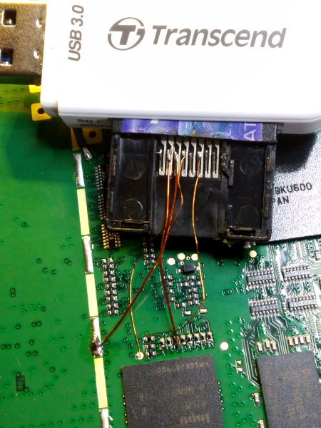

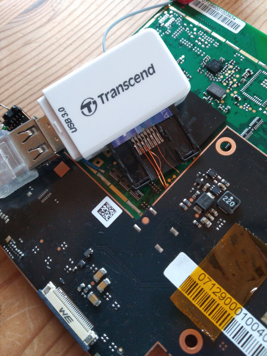

Now I needed to prevent the processor on the board from interfering with my communication. Finding the reset signal and keeping the processor in reset state should do it. I did not want to desolder the resistors.A reset controller is usually chip in a very small package which compares the supply voltage with a fixed threshold and pulls the reset signal low when the supply voltage is too low. There is a small 5-pin chip next to the processor with a convenient test pad next to it. Probing with a scope confirms that this is the reset signal.

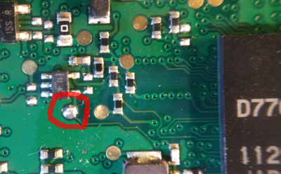

I soldered a wire from the test pad to GND to deacticate the processor. Now the Soundvision could be switched on, USB card reader attached to the PC and I got this:

```
[ 1279.631520] usb 1-1.2: new high-speed USB device number 5 using ehci-pci
[ 1279.743263] usb 1-1.2: New USB device found, idVendor=8564, idProduct=4000
[ 1279.743267] usb 1-1.2: New USB device strings: Mfr=3, Product=4, SerialNumber=5
[ 1279.743270] usb 1-1.2: Product: Transcend
[ 1279.743272] usb 1-1.2: Manufacturer: TS-RDF5 
[ 1279.743274] usb 1-1.2: SerialNumber: 000000000039
[ 1279.760097] usb-storage 1-1.2:1.0: USB Mass Storage device detected
[ 1279.760275] scsi host6: usb-storage 1-1.2:1.0
[ 1279.760462] usbcore: registered new interface driver usb-storage
[ 1279.762610] usbcore: registered new interface driver uas
[ 1280.769531] scsi 6:0:0:0: Direct-Access     TS-RDF5  SD  Transcend    TS37 PQ: 0 ANSI: 6
[ 1280.770521] sd 6:0:0:0: Attached scsi generic sg2 type 0
[ 1280.889189] sd 6:0:0:0: [sdb] 3530752 512-byte logical blocks: (1.81 GB/1.68 GiB)
[ 1280.890535] sd 6:0:0:0: [sdb] Write Protect is off
[ 1280.890540] sd 6:0:0:0: [sdb] Mode Sense: 23 00 00 00
[ 1280.891807] sd 6:0:0:0: [sdb] Write cache: disabled, read cache: enabled, doesn't support DPO or FUA
[ 1280.902576]  sdb: sdb1 sdb2 sdb3 sdb4
[ 1280.907022] sd 6:0:0:0: [sdb] Attached SCSI removable disk
```
Success!

Now I could save the partitions on the PC. The last command was just a lazy attempt to backup the MBR.

```
sudo dd if=/dev/sdb1 of=./sdb1.img
sudo dd if=/dev/sdb2 of=./sdb2.img
sudo dd if=/dev/sdb3 of=./sdb3.img
sudo dd if=/dev/sdb4 of=./sdb4.img
sudo dd if=/dev/sdb of=./sdb_start.img bs=1M count=32
```

More detailed flash disk layout:

```
$ sudo fdisk -l /dev/sdb
Disk /dev/sdb: 1,7 GiB, 1807745024 bytes, 3530752 sectors
Units: sectors of 1 * 512 = 512 bytes
Sector size (logical/physical): 512 bytes / 512 bytes
I/O size (minimum/optimal): 512 bytes / 512 bytes
Disklabel type: dos
Disk identifier: 0x00000000

Device     Boot   Start     End Sectors  Size Id Type
/dev/sdb1          2048   32767   30720   15M 83 Linux
/dev/sdb2         32768 1081343 1048576  512M 83 Linux
/dev/sdb3       1081344 2129919 1048576  512M 83 Linux
/dev/sdb4       2129920 3530751 1400832  684M 83 Linux
```

My understanding of the partitions:

* **sdb1 / mmcblk0p1** contains bootloader u-boot
* **sdb2 / mmcblk0p2** label "RootFs1", could not be mounted due to data corruption, probably used for firmware update
* **sdb3 / mmcblk0p3** same size as partition 2, contains root file system with linux distribution and the application software
* **sdb4 / mmcblk0p4** usually mounted to /home/root, probably contains user data and settings, could not be mounted due to data corruption

These partitions now needed to be transferred to another eMMC chip. I grabbed a cheap broken Android tablet from my pile of electronics junk and desoldered its eMMC chip with a hot air gun. That chip was then embarassingly quick and dirty connected to the card reader first. Fortunately the eMMC ball assignments are standardized by JEDEC. The MBR and the 4 partitions were written to that chip. Partition 3 was replaced by an image repaired by fsck.ext3. The new chip was an 8 Gbyte version.

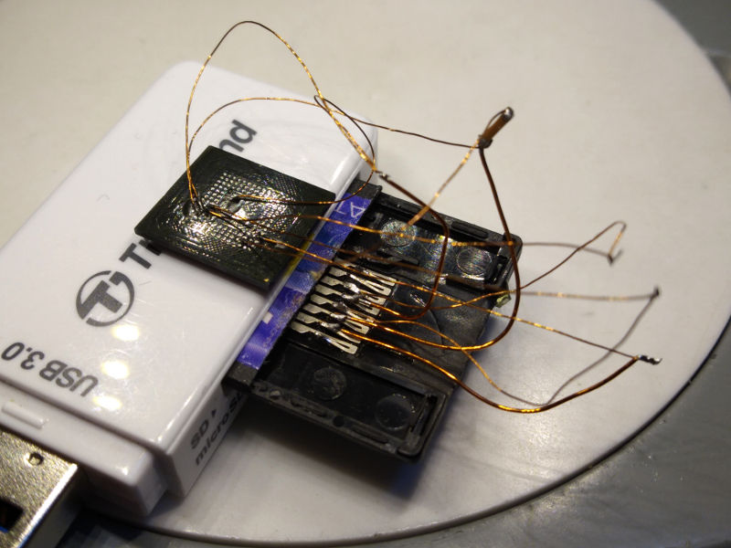

I removed the eMMC chip from the CPU board also using the hot air gun. This gave the opportunity to probe the remaining data lines and associate them with the resistors.

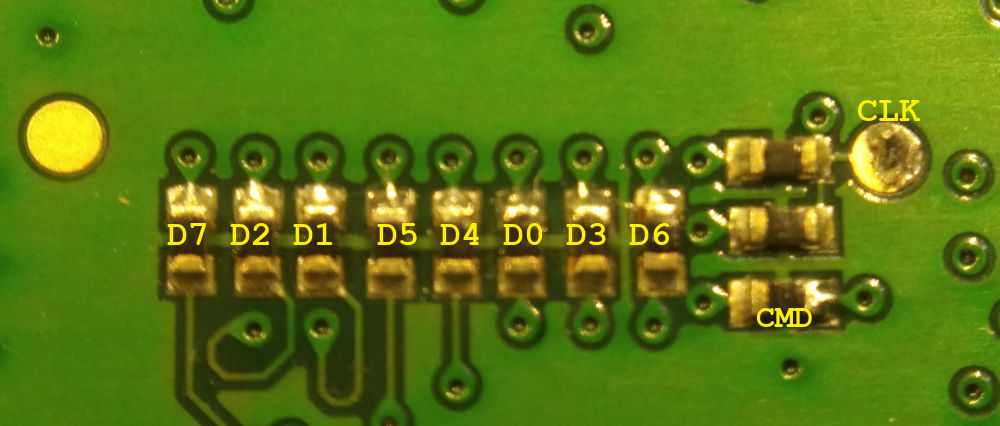

Then the fun started trying to solder the donor chip with 153-ball array back on the board. I found it next to impossible to see if the chip was aligned correctly because the balls only cover a small area under the chip, which cannot be seen from the side. I also forgot to put exact markings on the board before removing the original chip. A hot air gun is also inconvenient because it may blow the chip off the surface, so most heating was done from the underside. The board did not start. At one time I could see a message with 9600 baud at the serial interface saying `read MBR error`, probably from the on-chip bootloader.

I desoldered the chip again and saw that only few balls had connected at the previous soldering attempt. So I tried again. And again. Apparently BGA soldering is not part of my skill set and I don't own the right tools for the job.

Then I made a final attempt, connecting the chip to the board with enameled wires. This also did not work.

For scale: the circle of vision in the next picture has 11 mm diameter.

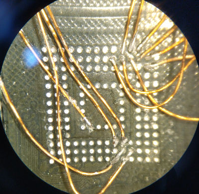

What a mess:

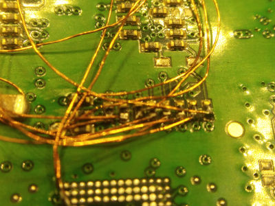


Possible issues:

* signal integrity issues due to the wires
* not enough supply voltage stability for running at full speed due to the wires and few power connections
* firmware cannot handle 8 GB chip or different maufacturer
* wrong clock speed for the new chip
* screwed up connection in this big mess of wires
* damaged board or some component due to repeated soldering attempts

These were too many different possible causes for me. At that time I had spent enough time with that 10 year old glorified bluetooth speaker to finally give up.

Maybe all this information gives someone an idea to replace the main board by a Raspberry Pi or something like that. Some peripherals are USB or I2C and could possibly be used by different hardware.


# Hardware

## Processor / SOC

Labels:
```
D77642BF1
1129KU600
JAPAN
```

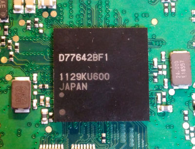

I could not find any datasheet. Dual core ARM probably made by Renesas. Might have display controller on chip, I could not find any dedicated graphics chip.

Relevant boot messages
```
CPU: ARMv7 Processor [411fc093] revision 3 (ARMv7), cr=10c57c7f
CPU: VIPT nonaliasing data cache, VIPT nonaliasing instruction cache
Machine: EMXX
Memory policy: ECC disabled, Data cache writealloc
Built 2 zonelists in Zone order, mobility grouping on.  Total pages: 89408
Kernel command line: root=/dev/mmcblk0p3 noinitrd console=ttyS0,115200n8n SELINUX_INIT=no mem=96M@0x40000000 mem=256M@0x50000000 rw video=qfb: ip=none rootfstype=ext3 rootwait
PID hash table entries: 2048 (order: 11, 8192 bytes)
Console: colour dummy device 80x30
Dentry cache hash table entries: 65536 (order: 6, 262144 bytes)
Inode-cache hash table entries: 32768 (order: 5, 131072 bytes)
Memory: 96MB 256MB = 352MB total
Memory: 353228KB available (3132K code, 343K data, 128K init)
Calibrating delay loop (skipped) preset value.. 1061.68 BogoMIPS (lpj=5308416)
Mount-cache hash table entries: 512
CPU: Testing write buffer coherency: ok
CPU1: Booted secondary processor
Calibrating delay loop (skipped) preset value.. 1061.68 BogoMIPS (lpj=5308416)
Brought up 2 CPUs
SMP: Total of 2 processors activated (2123.36 BogoMIPS).
```

## Display
The display is connected by a wide flat-flex cable. This is probably a parallel bus, no MIPI-DSI.

## Touchpad
The touchpad connector has pin descriptions for an I2C bus.

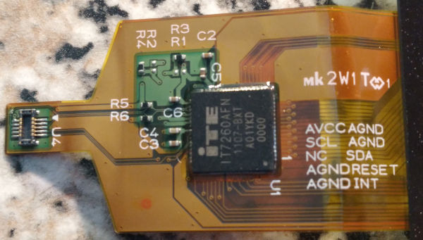

## Sound devices

Relevant boot messages
```
I2C driver for the Silicon Labs SI4705 FM Receiver, Version 0.0.1
as3658-misc: sucessfully loaded (major: 253)
###AS3658 probe SUCCEEDED
as3658: Reset reason = 0x0 (value = 0x84)
as3658: ASIC ID is CD 54
as3658: Unique ID (hex) is 51 00 00 B8 43 5D 08 20 62 F6 00
SI4705 revision C40 detected.
Registered character device for si4705 with major 111
###SI4705 probe SUCCEEDED
###CDMM10 probe SUCCEEDED
msp430_i2c: Initial state of SUBAMP_OTW = 0 and SUBAMP_SD = 0
###MSP430 probe SUCCEEDED
Advanced Linux Sound Architecture Driver Version 1.0.18a.
Starting sound codec.
TAS5716: Starting sound codec
###TAS5716 probe SUCCEEDED
TAS5716 Amplifier Audio driver
SNDSI4705: emxx_si4705_module_init: Enter
SNDSI4705: emxx_si4705_probe: Enter
SNDSI4705: snd_spdif_init_si4705: Enter
SNDSI4705: snd_si4705_codec_create: Enter
SNDSI4705: snd_si4705_reset: Enter
SNDSI4705: snd_si4705_reset: Leave
SNDSI4705: snd_si4705_codec_create: Leave
SNDSI4705: snd_spdif_init_si4705: Leave
SNDSI4705: emxx_si4705_probe: Set p_pcm_regs
SNDSI4705: snd_si4705_spdif_build: Enter
SNDSI4705: snd_si4705_spdif_build: After Loop
SNDSI4705: snd_si4705_spdif_build: Leave
SNDSI4705: Starting sound emxx si4705 codec.
SNDSI4705: emxx_si4705_probe: Leave
SNDSI4705: emxx_si4705_module_init: Leave
SNDCDMM10: emxx_cdmm10_module_init: Enter
SNDCDMM10: emxx_cdmm10_probe: Enter
SNDCDMM10: snd_spdif_init_cdmm10: Enter
SNDCDMM10: snd_cdmm10_codec_create: Enter
SNDCDMM10: snd_cdmm10_reset: Enter
SNDCDMM10: snd_cdmm10_reset: Leave
SNDCDMM10: snd_cdmm10_codec_create: Leave
SNDCDMM10: snd_spdif_init_cdmm10: Leave
SNDCDMM10: emxx_cdmm10_probe: Set p_pcm_regs
SNDCDMM10: Starting sound emxx cdmm10 codec.
SNDCDMM10: emxx_cdmm10_probe: Leave
SNDCDMM10: emxx_cdmm10_module_init: Leave
usbcore: registered new interface driver snd-usb-audio
ALSA device list:
  #0: EMXX Soundcard (Austria Microsystems - AS3658) (Austria Microsystems - AS3658)
  #1: EMXX Soundcard (TI Amplifier - TAS5716) (TI Amplifier - TAS5716)
  #2: sound emxx si4705 codec (emxx si4705)
  #3: sound emxx cdmm10 codec (emxx cdmm10)
Found hardware: "" "Austria Microsystems - AS3658" "" "" ""
Hardware is initialized using a generic method
/usr/share/alsa/init/default:60: value write error: Invalid argument
No state is present for cartas5716-codec: Error on line 1181, error code is 0
d AS3658
No state is present for card TAS5716
Found hardware: "" "TI Amplifier - TAS5716" "" "" ""
Hardware is initialized using a generic method
/usr/share/alsa/init/default:81: value write error: Invalid argument
No state is present for card TAS5716
No state is present for card emxxsi4705codec
Found hardware: "" "emxx si4705" "" "" ""
Hardware is initialized using a generic method
No state is present for card emxxsi4705codec
No state is present for card emxxcdmm10codec
Found hardware: "" "emxx cdmm10" "" "" ""
Hardware is initialized using a generic method
No state is present for card emxxcdmm10codec
```

## Ethernet
Ethernet is provided by an SMSC LAN9512 USB-to-ethernet chip on the Interface board.

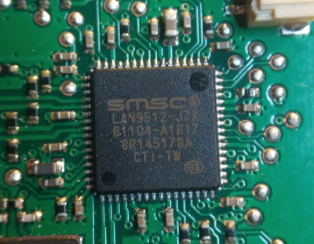


Relevant boot messages
```
ERROR: Module smsc9500 does not exist in /proc/modules
ERROR: Module smscusbnet does not exist in /proc/modules
ERROR: Module mii does not exist in /proc/modules
Read ethernet MAC address 48:f3:17:01:18:1b from the file system.
mii driver is coming
smscusbnet driver is coming
smsc9500 driver is coming
Driver smscusbnet.ko verison 1.01.16, built on 12:35:35, Dec 19 2011
SMSC_9500: ---------->in smsc9500_bind
SMSC_9500: Driver smsc9500.ko verison 1.01.16, built on 12:35:35, Dec 19 2011
SMSC_9500: EEPROM content not valid, not loaded
SMSC_9500: ---------->smsc9500_reset
SMSC_9500: dev->net->dev_addr 48:f3:17:01:18:1b
SMSC_9500: Read Value from HW_CFG : 0x00000000
SMSC_9500: Read Value from HW_CFG after writing HW_CFG_BIR_: 0x00001000
SMSC_9500: rx_urb_size= 18944
SMSC_9500: Read Value from BURST_CAP after writing: 0x00000025
SMSC_9500: Read Value from BULK_IN_DLY after writing: 0x00002000
SMSC_9500: Read Value from HW_CFG: 0x00001000
SMSC_9500: Read Value from HW_CFG after writing: 0x00001422
SMSC_9500: ID_REV = 0xec000002
SMSC_9500: FPGA_REV = 0x00000000
SMSC_9500: -->Phy_Initialize
SMSC_9500: using internal PHY 
SMSC_9500: dwPhyId==0x00C0001C,bPhyModel==0x0C,bPhyRev==0x03
SMSC_9500: PHY reset!!!
SMSC_9500_WARNING: Phy_SetAutoMdix: LAN9500 Auto MDIX feature controlled by hardware strap
SMSC_9500: <--Phy_Initialize, result=TRUE
SMSC_9500: <--------out of smsc9500_reset, return 0
SMSC_9500: The device is configed to support remote wakes
SMSC_9500: <--------out of bind, return 0
eth0: register 'smsc9500' at usb-emxx_ehci-1.2.1, smsc9500 USB 2.0 Ethernet, 48:f3:17:01:18:1b
###SMSC9500 probe SUCCEEDED
```
